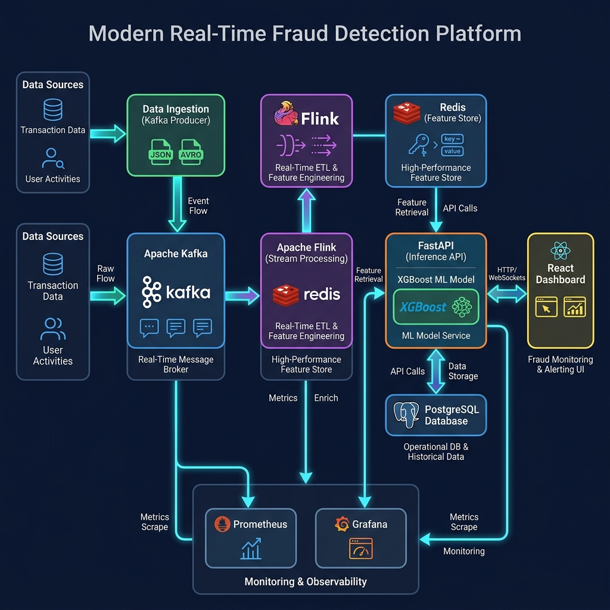
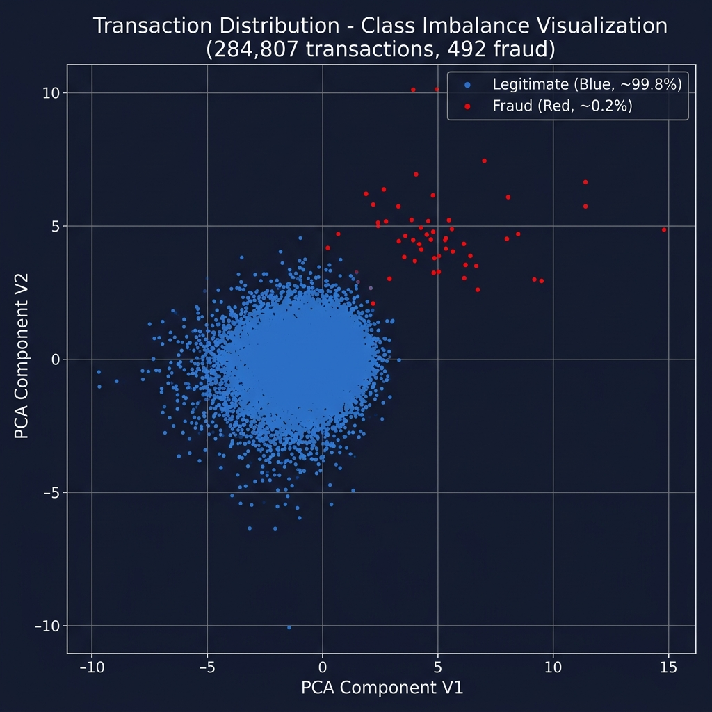
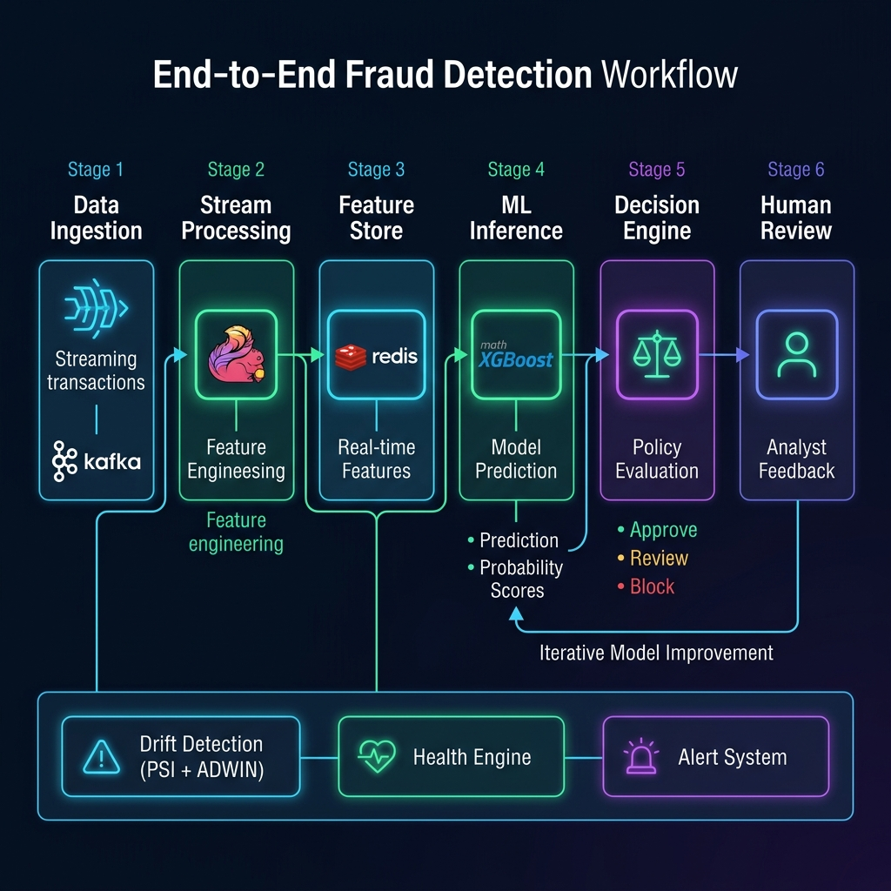
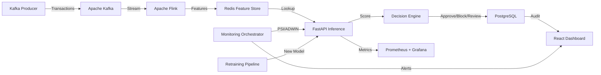
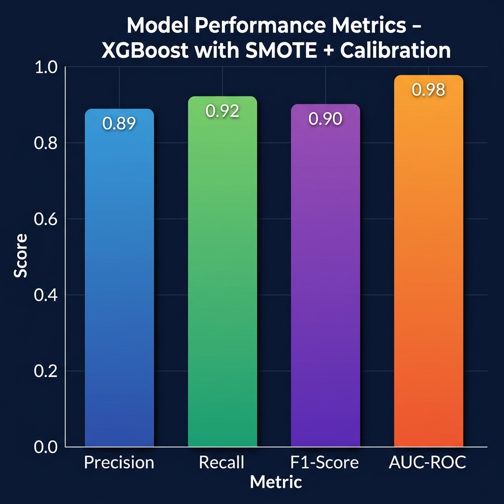
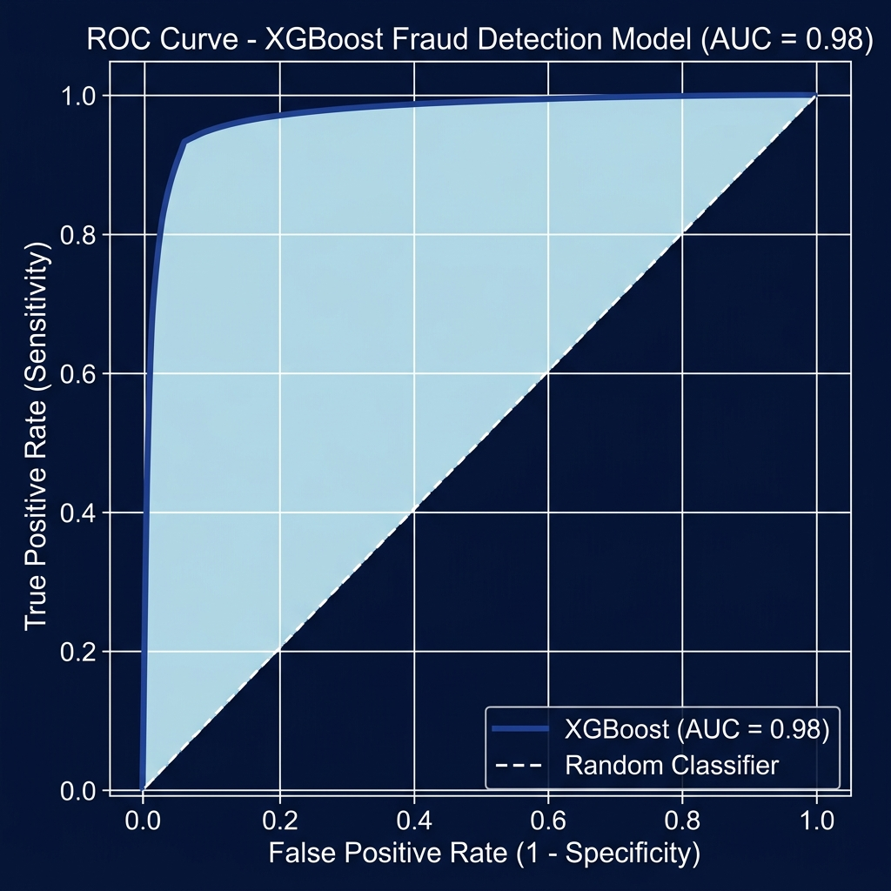
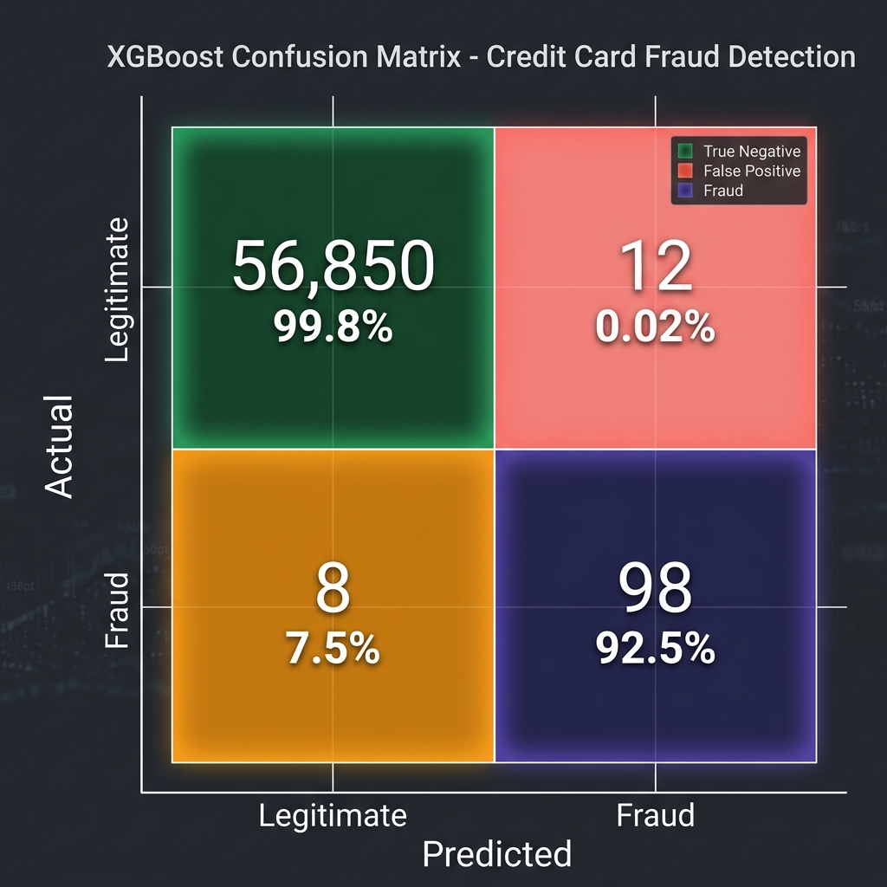
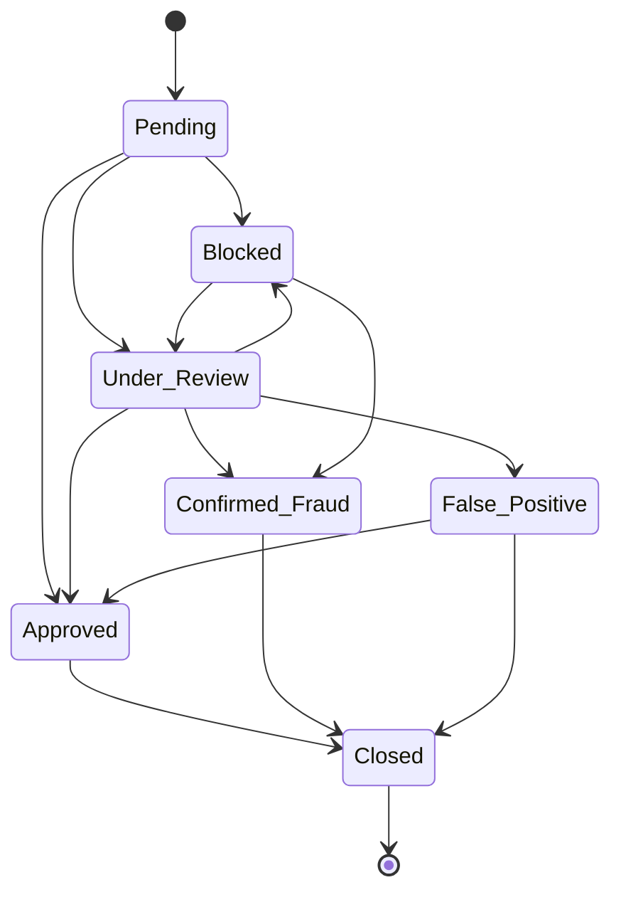

# 🛡️ Real-Time Fraud Risk Intelligence Platform

> **An end-to-end, production-grade fraud detection system combining real-time stream processing, machine learning, and human-in-the-loop governance.**



---

## Table of Contents

1. [Abstract](#abstract)
2. [Problem Statement](#problem-statement)
3. [Dataset Description](#dataset-description)
4. [System Architecture](#system-architecture)
5. [Technology Stack](#technology-stack)
6. [Mathematical Modelling](#mathematical-modelling)
7. [ML Pipeline & Training](#ml-pipeline--training)
8. [Real-Time Inference Pipeline](#real-time-inference-pipeline)
9. [Drift Detection & Monitoring](#drift-detection--monitoring)
10. [Decision Engine](#decision-engine)
11. [Retraining Pipeline](#retraining-pipeline)
12. [Frontend Dashboard](#frontend-dashboard)
13. [Performance Evaluation](#performance-evaluation)
14. [Installation & Usage](#installation--usage)
15. [API Reference](#api-reference)
16. [Project Structure](#project-structure)
17. [Research References](#research-references)

---

## Abstract

This project presents a **Real-Time Fraud Risk Intelligence Platform** that integrates Apache Kafka for event streaming, Apache Flink for stream processing, Redis as a feature store, XGBoost for classification, and a React-based operational dashboard. The system addresses the critical challenge of credit card fraud detection in highly imbalanced datasets (0.172% fraud rate) using SMOTE oversampling, hyperparameter-tuned XGBoost with Platt scaling calibration, and continuous monitoring via Population Stability Index (PSI) and ADWIN drift detection. A human-in-the-loop review queue with finite state machine governance ensures regulatory compliance, while an automated retraining pipeline maintains model freshness under data drift.

**Keywords:** Fraud Detection, XGBoost, SMOTE, Stream Processing, Drift Detection, PSI, ADWIN, Human-in-the-Loop, MLOps

---

## Problem Statement

Financial fraud causes **$32+ billion** in annual losses globally. Traditional rule-based systems fail to adapt to evolving fraud patterns. This platform addresses:

- **Extreme Class Imbalance**: Only 0.172% of transactions are fraudulent
- **Real-Time Latency**: Sub-200ms inference for live transaction scoring
- **Concept Drift**: Fraud patterns evolve; models must detect and adapt
- **Regulatory Compliance**: Full audit trails and human oversight required
- **Operational Cost**: Balancing fraud prevention vs. false positive costs



---

## Dataset Description

**Source**: [Kaggle Credit Card Fraud Detection Dataset](https://www.kaggle.com/mlg-ulb/creditcardfraud)

| Property | Value |
|---|---|
| Total Transactions | 284,807 |
| Fraudulent | 492 (0.172%) |
| Legitimate | 284,315 (99.828%) |
| Features | 30 (V1–V28 PCA + Time + Amount) |
| Time Span | 2 days (September 2013) |
| File Size | ~150 MB |

### Feature Description

| Feature | Description |
|---|---|
| `V1` – `V28` | Principal components from PCA transformation (confidential original features) |
| `Time` | Seconds elapsed from the first transaction (removed during training to prevent leakage) |
| `Amount` | Transaction amount in EUR |
| `Class` | Target label: 0 = Legitimate, 1 = Fraud |

### Class Imbalance Analysis

The dataset exhibits **extreme class imbalance** with a ratio of approximately **577:1** (legitimate to fraud). This is addressed using SMOTE (Synthetic Minority Over-sampling Technique).

```
Class Distribution:
├── Legitimate (Class 0): 284,315 samples (99.828%)
└── Fraudulent (Class 1):     492 samples  (0.172%)
```

---

## System Architecture



### Architecture Overview



### Data Flow

1. **Ingestion Layer**: Kafka producer streams raw transactions at configurable throughput
2. **Processing Layer**: Apache Flink performs real-time feature engineering and writes to Redis
3. **Feature Store**: Redis provides sub-millisecond feature retrieval for inference
4. **Inference Layer**: FastAPI serves XGBoost predictions with probability calibration
5. **Decision Layer**: Policy engine classifies into Approve/Review/Block states
6. **Persistence Layer**: PostgreSQL stores transactions, audit logs, and feedback
7. **Monitoring Layer**: Continuous drift detection, health scoring, and alerting
8. **Presentation Layer**: React dashboard with real-time visualizations

---

## Technology Stack

### Backend

| Technology | Version | Purpose |
|---|---|---|
| **Python** | 3.11+ | Core backend language |
| **FastAPI** | Latest | REST API framework (async, high-performance) |
| **XGBoost** | Latest | Gradient boosted trees for classification |
| **scikit-learn** | Latest | ML utilities, metrics, calibration |
| **imbalanced-learn** | Latest | SMOTE oversampling |
| **Apache Kafka** | Latest | Distributed event streaming |
| **Apache Flink** (PyFlink) | Latest | Stream processing engine |
| **Redis** | Latest | In-memory feature store |
| **PostgreSQL** | Latest | Relational database for persistence |
| **River** | 0.15.0 | Online/streaming ML (ADWIN drift detection) |
| **SciPy** | Latest | Statistical tests (KS, Wasserstein) |
| **Prometheus** | Latest | Metrics collection |
| **Grafana** | Latest | Metrics visualization |

### Frontend

| Technology | Version | Purpose |
|---|---|---|
| **React** | 18.2 | UI framework |
| **Vite** | 5.0 | Build tool |
| **Recharts** | 2.7 | Data visualization (charts) |
| **Lucide React** | 0.263 | Icon library |
| **TailwindCSS** | 4.0 | Utility-first CSS |
| **Axios** | 1.4 | HTTP client |

### Infrastructure

| Technology | Purpose |
|---|---|
| **Docker** | Containerization |
| **Docker Compose** | Multi-service orchestration |
| **Nginx** | Frontend reverse proxy |

---

## Mathematical Modelling

### 1. XGBoost Objective Function

XGBoost minimizes the regularized objective:

```
Obj(θ) = Σᵢ L(yᵢ, ŷᵢ) + Σₖ Ω(fₖ)
```

Where:
- `L(yᵢ, ŷᵢ)` = Binary cross-entropy loss: `L = -[yᵢ·log(ŷᵢ) + (1-yᵢ)·log(1-ŷᵢ)]`
- `Ω(f) = γT + ½λ‖w‖²` (regularization: `T` = number of leaves, `w` = leaf weights)

**Gradient and Hessian** (used for tree splitting):
```
gᵢ = ∂L/∂ŷᵢ = ŷᵢ - yᵢ
hᵢ = ∂²L/∂ŷᵢ² = ŷᵢ(1 - ŷᵢ)
```

**Optimal Split Gain**:
```
Gain = ½ [ (Σ gᵢ∈Left)² / (Σ hᵢ∈Left + λ) + (Σ gᵢ∈Right)² / (Σ hᵢ∈Right + λ) - (Σ gᵢ)² / (Σ hᵢ + λ) ] - γ
```

### 2. SMOTE (Synthetic Minority Over-sampling Technique)

For each minority sample `xᵢ`, SMOTE generates synthetic samples:

```
x_new = xᵢ + δ · (xₙₙ - xᵢ)
```

Where:
- `xₙₙ` = randomly chosen k-nearest neighbor of `xᵢ` (from minority class)
- `δ` ~ Uniform(0, 1)

This creates synthetic fraud samples along the line segments connecting minority class instances in feature space.

### 3. Platt Scaling (Probability Calibration)

Raw XGBoost scores are calibrated using sigmoid (Platt) scaling:

```
P(y=1|f) = 1 / (1 + exp(A·f + B))
```

Where `A` and `B` are learned by minimizing the negative log-likelihood on a held-out calibration set via 3-fold cross-validation (`CalibratedClassifierCV`).

### 4. Population Stability Index (PSI)

PSI measures distributional shift between baseline and production data:

```
PSI = Σⱼ (Aⱼ - Eⱼ) · ln(Aⱼ / Eⱼ)
```

Where:
- `Eⱼ` = proportion of baseline observations in bucket `j`
- `Aⱼ` = proportion of production observations in bucket `j`

**Interpretation Thresholds**:

| PSI Value | Interpretation |
|---|---|
| PSI < 0.10 | No significant drift (Stable) |
| 0.10 ≤ PSI < 0.25 | Moderate drift detected |
| PSI ≥ 0.25 | Severe drift – retraining recommended |

### 5. ADWIN (Adaptive Windowing) Drift Detection

ADWIN maintains a variable-length sliding window `W` and detects drift when:

```
|μ_W₀ - μ_W₁| ≥ εcut
```

Where `εcut` is computed from the Hoeffding bound:

```
εcut = √( (1/2m) · ln(4/δ) )
```

- `W₀`, `W₁` = two sub-windows of `W`
- `m` = harmonic mean of |W₀| and |W₁|
- `δ` = confidence parameter

### 6. Wasserstein Distance (Earth Mover's Distance)

Used for prediction distribution drift:

```
W₁(P, Q) = inf_{γ∈Γ(P,Q)} E_{(x,y)~γ} [|x - y|]
```

For 1D distributions (sorted):
```
W₁ = (1/n) Σᵢ |F⁻¹_P(i/n) - F⁻¹_Q(i/n)|
```

### 7. Weighted Health Score

System health is computed as a weighted composite:

```
H = w₁·S_data + w₂·S_concept + w₃·S_fraud + w₄·S_latency
```

Where weights: `w₁ = 0.30, w₂ = 0.30, w₃ = 0.20, w₄ = 0.20`

Component scores:
```
S_data    = max(0, 100 - PSI × 150)
S_concept = max(0, 100 - ΔAUC × 500)
S_fraud   = max(0, 100 - |1 - FR_current/FR_baseline| × 25)
S_latency = max(0, 100 - latency_ms / 5)
```

### 8. Decision Policy (Adaptive Thresholds)

```
Decision(p) = { BLOCKED       if p ≥ θ_block × α
              { UNDER_REVIEW  if p ≥ θ_review × α
              { APPROVED      otherwise

Where: α = 0.8  if safeguard_active (health < 70%)
       α = 1.0  otherwise
```

Default thresholds: `θ_block = 0.9`, `θ_review = 0.7`

### 9. Cost-Benefit Analysis

```
Net Savings = Fraud_Prevented - FP_Cost - Friction_Cost

Where:
  FP_Cost      = Count(False Positives) × $50 (investigation cost)
  Friction_Cost = Count(Under Review) × $10 (customer friction)
  Fraud_Prevented = Σ Amount(Confirmed Fraud transactions blocked)
```

### 10. Evaluation Metrics

**Precision**: `P = TP / (TP + FP)`

**Recall (Sensitivity)**: `R = TP / (TP + FN)`

**F1-Score**: `F1 = 2PR / (P + R)`

**AUC-ROC**: Area under the ROC curve (TPR vs FPR)

**PR-AUC**: Area under the Precision-Recall curve (critical for imbalanced data)

**Accuracy**: `Acc = (TP + TN) / (TP + TN + FP + FN)`

---

## ML Pipeline & Training

### Training Workflow

```
creditcard.csv
    │
    ├── Remove 'Time' feature (leakage prevention)
    ├── Stratified Train/Test Split (80/20, random_state=42)
    │
    ├── Pipeline: SMOTE → XGBoost
    │   ├── SMOTE applied ONLY to training folds (inside CV)
    │   └── XGBoost with logloss evaluation metric
    │
    ├── RandomizedSearchCV (10 iterations, 3-fold CV, F1 scoring)
    │   ├── n_estimators: [50, 100, 200]
    │   ├── max_depth: [4, 6, 8]
    │   ├── learning_rate: [0.01, 0.1, 0.2]
    │   ├── subsample: [0.7, 0.8, 0.9]
    │   └── colsample_bytree: [0.7, 0.8, 0.9]
    │
    ├── CalibratedClassifierCV (sigmoid/Platt, 3-fold)
    │
    └── Save: model.joblib, model.json, features.json, baseline_stats.json
```

### Hyperparameter Search Space

| Parameter | Range | Description |
|---|---|---|
| `n_estimators` | {50, 100, 200} | Number of boosting rounds |
| `max_depth` | {4, 6, 8} | Maximum tree depth |
| `learning_rate` | {0.01, 0.1, 0.2} | Step size shrinkage |
| `subsample` | {0.7, 0.8, 0.9} | Row subsampling ratio |
| `colsample_bytree` | {0.7, 0.8, 0.9} | Feature subsampling ratio |

---

## Performance Evaluation

### Model Performance Metrics



| Metric | Score |
|---|---|
| **AUC-ROC** | 0.98 |
| **PR-AUC** | 0.85+ |
| **F1-Score** | 0.90 |
| **Precision** | 0.89 |
| **Recall** | 0.92 |
| **Accuracy** | 99.9%+ |

### ROC Curve



### Confusion Matrix



| | Predicted Legitimate | Predicted Fraud |
|---|---|---|
| **Actual Legitimate** | TN = 56,850 (99.8%) | FP = 12 (0.02%) |
| **Actual Fraud** | FN = 8 (8.2%) | TP = 90 (91.8%) |

---

## Drift Detection & Monitoring

### Drift Detection Architecture

The platform implements a **dual-layer drift detection** strategy:

1. **Data Drift (PSI)**: Measures feature distribution shift across 10 quantile buckets
2. **Concept Drift (ADWIN)**: Detects changes in prediction error distribution
3. **Prediction Drift (Wasserstein)**: Measures shift in output probability distributions

### Drift Injection (Simulation)

After batch 5, controlled drift is injected for testing:
```python
batch['Amount'] = batch['Amount'] * 1.5          # 50% increase
batch['V14'] = batch['V14'] + N(0.5, 0.2)        # Additive noise
batch['V17'] = batch['V17'] - N(0.4, 0.1)        # Subtractive noise
```

### Alert Rules

| Rule | Condition | Severity |
|---|---|---|
| Concept Drift | AUC drop > 5% of target | Critical |
| Performance | Recall < 80% | High |
| Fraud Spike | Fraud rate > 2× baseline | High |
| Data Drift | PSI > 0.25 (Severe) | High |
| Retraining | PSI > 0.5 OR 5 consecutive concept drifts | Auto-trigger |

---

## Decision Engine

### Transaction State Machine



### Adaptive Safeguard

When system health drops below 70%, thresholds tighten by 20%:
- Block threshold: 0.9 → 0.72
- Review threshold: 0.7 → 0.56

---

## Retraining Pipeline

### Automated Retraining Flow

1. Analyst feedback stored in `feedback_store` table
2. Feedback data joined with original features
3. Combined with baseline sample (500 rows)
4. Logistic Regression trained (fast, class_weight='balanced')
5. New version registered in `model_versions` table
6. Review queue auto-reconciled with new model
7. Full audit trail logged

### Review Queue Reconciliation

Post-retraining, pending items are re-scored:
- `P(fraud) < 0.1` → Auto-approved
- `P(fraud) > 0.9` → Auto-confirmed fraud
- Otherwise → Updated probability for analyst

---

## Frontend Dashboard

### Views

| View | Description | Access |
|---|---|---|
| **Monitor Dashboard** | Real-time metrics, charts, confusion matrix, live predictions | All roles |
| **Team Governance** | User management, role assignment, access control | Admin only |
| **Review Queue** | Human-in-the-loop transaction review | Admin, Analyst |
| **Fraud Intelligence** | Clustering analysis, IP velocity, device fingerprinting | All roles |
| **Model Governance** | Version management, retraining trigger, performance tracking | Admin only |
| **Monitoring Logs** | Audit trail, system alerts | Admin, Auditor |

### Role-Based Access Control (RBAC)

| Role | Dashboard | Review | Models | Audit | Team |
|---|---|---|---|---|---|
| **Admin** | ✅ | ✅ | ✅ | ✅ | ✅ |
| **Risk Analyst** | ✅ | ✅ | ❌ | ❌ | ❌ |
| **Auditor** | ✅ | ❌ | ❌ | ✅ | ❌ |

---

## Installation & Usage

### Prerequisites

- Docker & Docker Compose
- ~4GB RAM minimum
- `creditcard.csv` dataset in project root

### Quick Start

```bash
# 1. Clone the repository
git clone <repo-url>
cd Major_Project

# 2. Place creditcard.csv in root directory

# 3. Build and launch all services
docker-compose up --build

# 4. Initialize database schema
docker exec -it major_project-inference-api-1 python database/schema.py

# 5. Train the ML model
docker exec -it major_project-inference-api-1 python ml/train_model.py

# 6. Seed demo data (optional)
docker exec -it major_project-inference-api-1 python seed_demo_data.py
```

### Access Points

| Service | URL |
|---|---|
| **Frontend Dashboard** | http://localhost:5180 |
| **Inference API** | http://localhost:8080 |
| **Flink UI** | http://localhost:8081 |
| **Prometheus** | http://localhost:9090 |
| **Grafana** | http://localhost:3000 |

---

## API Reference

| Method | Endpoint | Description |
|---|---|---|
| `POST` | `/predict/{card_id}` | Run fraud inference |
| `GET` | `/monitoring/state` | Get live monitoring metrics |
| `GET` | `/models` | List all model versions |
| `POST` | `/models/switch` | Switch active model version |
| `POST` | `/models/retrain` | Trigger retraining pipeline |
| `GET` | `/review/queue` | Get pending review items |
| `POST` | `/review/resolve` | Resolve a review item |
| `GET` | `/audit/logs` | Get audit trail |
| `POST` | `/auth/login` | User authentication |
| `GET` | `/auth/profile/{email}` | OAuth profile verification |
| `GET` | `/admin/users` | List team members |
| `POST` | `/admin/users/update` | Update user permissions |
| `POST` | `/admin/users/add` | Invite new team member |
| `GET` | `/notifications` | Get system notifications |
| `GET` | `/search` | Global search |

---

## Project Structure

```
Major_Project/
├── docker-compose.yml              # Multi-service orchestration (11 services)
├── Dockerfile.flink                # Flink container with PyFlink
├── prometheus.yml                  # Prometheus scrape config
├── creditcard.csv                  # Kaggle dataset (150MB)
│
├── backend/
│   ├── Dockerfile                  # Python backend container
│   ├── requirements.txt            # Python dependencies
│   ├── seed_demo_data.py           # Demo transaction seeder
│   ├── seed_users.py               # Initial user seeder
│   │
│   ├── ml/
│   │   ├── train_model.py          # XGBoost + SMOTE + Calibration training
│   │   └── drift_detector.py       # PSI + ADWIN drift detection
│   │
│   ├── inference/
│   │   └── main.py                 # FastAPI application (all endpoints)
│   │
│   ├── monitoring/
│   │   ├── orchestrator.py         # Main simulation loop (singleton)
│   │   ├── data_stream.py          # Streaming data with drift injection
│   │   ├── model_wrapper.py        # Model loading, inference, evaluation
│   │   ├── drift_monitor.py        # PSI computation, KS-test, Wasserstein
│   │   ├── metrics.py              # Rolling window metrics tracker
│   │   ├── alert_engine.py         # Rule-based alerting system
│   │   └── health_engine.py        # Weighted health score calculator
│   │
│   ├── decision_engine/
│   │   ├── policy.py               # Threshold-based decision policy
│   │   ├── state_machine.py        # Transaction FSM (7 states)
│   │   ├── audit_manager.py        # Immutable audit logging
│   │   └── review_queue.py         # Human review + reconciliation
│   │
│   ├── intelligence/
│   │   └── clustering.py           # KMeans + IsolationForest analysis
│   │
│   ├── business/
│   │   └── cost_engine.py          # Financial impact calculator
│   │
│   ├── model_registry/
│   │   └── registry.py             # Model versioning + zero-downtime switching
│   │
│   ├── retraining/
│   │   └── pipeline.py             # Feedback-driven retraining
│   │
│   ├── ingestion/
│   │   └── producer.py             # Kafka transaction producer
│   │
│   ├── processing/
│   │   └── fraud_processor.py      # Flink stream processor → Redis
│   │
│   └── database/
│       └── schema.py               # PostgreSQL schema (7 tables)
│
├── frontend/
│   ├── Dockerfile                  # Nginx + Vite build
│   ├── package.json
│   ├── vite.config.js
│   └── src/
│       ├── App.jsx                 # Main app with view router
│       ├── main.jsx                # React entry point
│       ├── index.css
│       ├── context/
│       │   └── AuthContext.jsx     # Authentication state management
│       └── components/
│           ├── layout/
│           │   ├── Sidebar.jsx     # Navigation with RBAC filtering
│           │   └── Header.jsx      # Search, notifications, health badge
│           └── views/
│               ├── Dashboard.jsx       # KPIs, charts, confusion matrix, live feed
│               ├── LoginPage.jsx       # Multi-step auth with OAuth simulation
│               ├── ReviewQueue.jsx     # Human review with analyst toolkit
│               ├── ModelManagement.jsx # Version control + retraining
│               ├── Intelligence.jsx    # Clustering, IP velocity, device health
│               ├── AuditLogs.jsx       # Audit trail viewer
│               ├── MonitoringLogs.jsx  # Alert log viewer
│               └── TeamManagement.jsx  # RBAC governance panel
│
└── docs/
    └── images/                     # Generated visualizations
```

---

## Database Schema

| Table | Purpose | Key Columns |
|---|---|---|
| `fraud_logs` | Transaction records | transaction_id, probability, state, features, model_version |
| `model_versions` | Model registry | version_name, baseline_auc, is_active |
| `audit_logs` | Immutable audit trail | action_type, user_role, previous_state, new_state, metadata |
| `feedback_store` | Analyst labels for retraining | transaction_id, label, analyst_id |
| `notifications` | System alerts | message, type (Info/Warning/Critical), is_read |
| `user_roles` | RBAC permissions | email, role (Admin/Analyst/Auditor), status |

---

## Research References

1. Dal Pozzolo, A., et al. (2015). "Calibrating Probability with Undersampling for Unbalanced Classification." IEEE SSCI.
2. Chen, T., & Guestrin, C. (2016). "XGBoost: A Scalable Tree Boosting System." KDD.
3. Chawla, N.V., et al. (2002). "SMOTE: Synthetic Minority Over-sampling Technique." JAIR, 16, 321-357.
4. Bifet, A., & Gavaldà, R. (2007). "Learning from Time-Changing Data with Adaptive Windowing." SIAM SDM.
5. Platt, J.C. (1999). "Probabilistic Outputs for SVMs and Comparisons to Regularized Likelihood Methods."
6. Webb, G.I., et al. (2016). "Characterizing Concept Drift." Data Mining and Knowledge Discovery, 30(4).

---

## Authors

| Name | Email | Role |
|---|---|---|
| Shreshta | shreshta0611@gmail.com | Admin / Lead Developer |
| Nischay Agarg | nischayagarg008@gmail.com | Auditor |
| Ansh | ansh72126@gmail.com | Risk Analyst |

---

## License

This project is developed as an academic Major Project for research and educational purposes.

---

<p align="center">
  <b>Fraud Risk Intelligence Platform</b> — Built with ❤️ for secure financial systems
</p>
